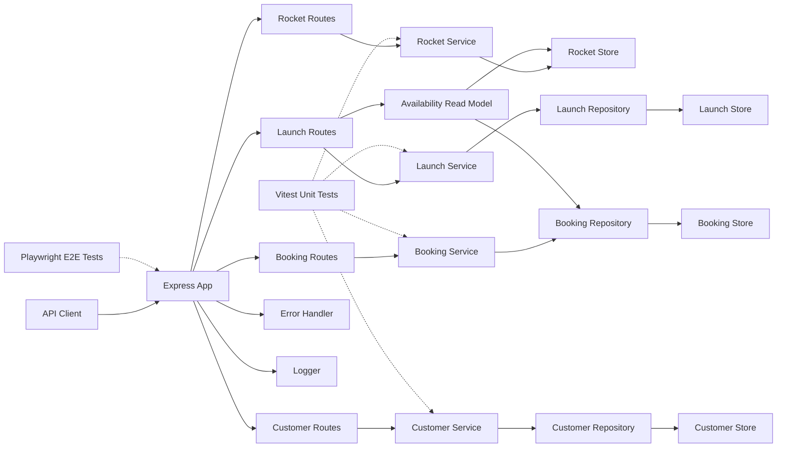

# AstroBookings Architectural Design Document

AstroBookings is a single-process Express REST API for managing rockets, launches, customers, and seat bookings for demo space travel operations.

### Table of Contents
- [Stack and Tooling](#stack-and-tooling)
- [System Summary](#system-summary)
- [System Architecture](#system-architecture)
- [Software Architecture](#software-architecture)
- [Architecture Decisions Record](#architecture-decisions-record)
- [Explicitly Out of Scope](#explicitly-out-of-scope)

## Stack and Tooling

### Technology Stack
- Language: TypeScript 5.6
- Runtime: Node.js 22
- Framework: Express 4.21
- Data store: In-memory collections
- Testing: Playwright 1.58 and Vitest 4.0
- Logging: Console logger with log levels

### Development Tools
- Build: `tsc`
- Dev server: `tsx watch src/index.ts`
- Start: `node dist/index.js`
- Tests: `playwright test`, `vitest run`, `vitest run --coverage`
- Package manager: npm
- Deployment: None configured

## System Summary

The current implementation provides in-memory CRUD for rockets, launches, and customers; booking creation and lookup; launch availability calculation; shared validation and error handling; leveled console logging; and automated API and unit tests. The system does not implement authentication, persistent storage, real payment execution, refund workflows, or external integrations.

## System Architecture

## Software Architecture

The codebase follows a layered modular design.

- **HTTP layer**: Express mounts `/health`, `/api/rockets`, `/api/launches`, `/api/customers`, and `/api/bookings`.
- **Route layer**: Route modules parse inputs, call services, compose read models, and map errors into JSON responses.
- **Service layer**: Domain services enforce business rules such as rocket validation, customer uniqueness, launch scheduling constraints, booking seat checks, and booking eligibility on active launches.
- **Data access layer**: Stores and repositories keep domain entities in memory and generate IDs inside the running process.
- **Read-model composition**: Launch availability and enriched booking responses are computed at request time from multiple domain sources rather than persisted as separate entities.
- **Cross-cutting utilities**: Shared modules provide validation helpers, error normalization, and leveled logging.
- **Test architecture**: Playwright validates public API behavior end-to-end; Vitest validates business logic and repository behavior in isolation.

### Domain Notes

- Rockets are the capacity source for launches.
- Launches default to `scheduled` when status is omitted.
- Booking is allowed only when a launch is `active`.
- The current implementation stores launch status directly on update and does not yet enforce a formal transition graph.
- `paymentStatus` exists on bookings as a placeholder field, but there is no payment gateway or payment ledger.

## Architecture Decisions Record

### ADR 1: Use Express for the REST API
- **Decision**: Use Express 4.21 for HTTP routing and middleware.
- **Status**: Accepted
- **Context**: The product needs a small, stable framework for a demo backend.
- **Consequences**: Fast iteration, low ceremony, and explicit route handling.

### ADR 2: Keep all domain state in process memory
- **Decision**: Store rockets, launches, customers, and bookings in memory.
- **Status**: Accepted
- **Context**: The system is intended for training and architecture practice rather than production deployment.
- **Consequences**: Data resets on restart and there are no transactional or concurrency guarantees.

### ADR 3: Centralize validation and error normalization
- **Decision**: Reuse shared validation and error-handling utilities across route and service layers.
- **Status**: Accepted
- **Context**: Consistent request validation and JSON error shapes are required across all domains.
- **Consequences**: Reuse improves consistency, but domain-specific rules still live in services.

### ADR 4: Derive launch availability at read time
- **Decision**: Compute availability from rocket capacity minus non-cancelled booking seat totals instead of persisting it.
- **Status**: Accepted
- **Context**: Availability depends on multiple mutable records and does not need its own storage in the demo architecture.
- **Consequences**: Read responses stay current without extra synchronization, but all values disappear on restart.

### ADR 5: Use email as stable customer identity for business operations
- **Decision**: Keep customer email unique, normalized for lookup, and immutable after creation.
- **Status**: Accepted
- **Context**: Bookings need a stable customer identifier without introducing authentication or external identity management.
- **Consequences**: Integration remains simple, but identity and access control are intentionally absent.

### ADR 6: Keep payment state on bookings without implementing payment infrastructure
- **Decision**: Model `paymentStatus` on bookings as a placeholder field only.
- **Status**: Accepted
- **Context**: The roadmap includes payment processing, but the current demo stops at status storage.
- **Consequences**: Booking records can represent pending or final payment state later, but there is no gateway, transaction history, or refund flow today.

### ADR 7: Split acceptance testing by layer
- **Decision**: Use Playwright for API scenarios and Vitest for unit-level service and repository tests.
- **Status**: Accepted
- **Context**: The project needs confidence in both public behavior and business rules.
- **Consequences**: End-to-end flows are protected without losing fast feedback for core logic.

## Explicitly Out of Scope

- Authentication and authorization.
- Persistent databases and migrations.
- Real payment gateway integration and reconciliation.
- Refunds and cancellation finance workflows.
- Notifications, background jobs, or event-driven integrations.
- Strict lifecycle transition guards until the backlog hardening item is implemented.
