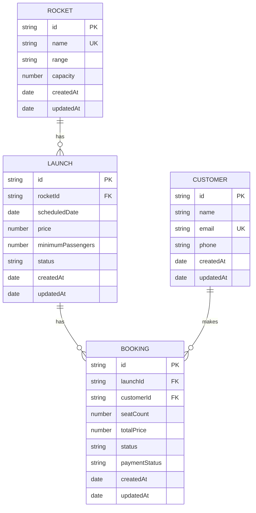

# AstroBookings Entity-Relationship Model

## Entities

### Rocket
- **id**: string
- **name**: string, unique
- **range**: suborbital | orbital | moon | mars
- **capacity**: number, 1..10
- **createdAt**: Date
- **updatedAt**: Date

**Rules:**
- Name must be unique across all rockets.
- Capacity must be between 1 and 10.
- Range must be one of the supported values.

### Launch
- **id**: string
- **rocketId**: string, foreign key to Rocket
- **scheduledDate**: Date
- **price**: number, greater than 0
- **minimumPassengers**: number, at least 1 and not greater than rocket capacity
- **status**: scheduled | active | completed | cancelled
- **createdAt**: Date
- **updatedAt**: Date

**Rules:**
- Scheduled date must be in the future at creation time.
- Price must be positive.
- Minimum passengers must not exceed the selected rocket capacity.
- Launch status is stored directly; strict transition guards are backlog work.

### Customer
- **id**: string
- **name**: string
- **email**: string, unique
- **phone**: string
- **createdAt**: Date
- **updatedAt**: Date

**Rules:**
- Email must be unique and valid.
- Email is immutable after creation.
- Customer lookups normalize email for uniqueness and retrieval.

### Booking
- **id**: string
- **launchId**: string, foreign key to Launch
- **customerId**: string, foreign key to Customer
- **seatCount**: number, at least 1
- **totalPrice**: number
- **status**: pending | confirmed | cancelled
- **paymentStatus**: pending | completed | failed
- **createdAt**: Date
- **updatedAt**: Date

**Rules:**
- Seat count must be at least 1.
- Total price is calculated when the booking is created.
- Booking is allowed only on active launches.
- Overbooking is rejected based on derived availability.
- Cancelled bookings are excluded from seat-consumption totals.

## Relationships

## Derived API Read Models

These fields appear in API responses but are not stored as standalone entity attributes:

### Launch Availability Response
- **rocketName**: string
- **totalSeats**: number
- **bookedSeats**: number
- **availableSeats**: number

### Enriched Booking Response
- **customerEmail**: string
- **rocketName**: string
- **launchPrice**: number

## Implementation Notes

**Implemented:**
- Rocket, launch, customer, and booking entities are all active in the current codebase.
- Availability is derived from rocket capacity and non-cancelled booking totals.
- `paymentStatus` already exists on bookings as a state field.

**Not Yet Implemented:**
- A separate Payment entity.
- Refund workflows.
- Strict launch lifecycle transition enforcement.

**Data Integrity Constraints:**
- Launches reference rockets.
- Bookings reference launches and customers.
- Customer email and rocket name must stay unique.
- Availability is derived, not stored as a separate entity.
